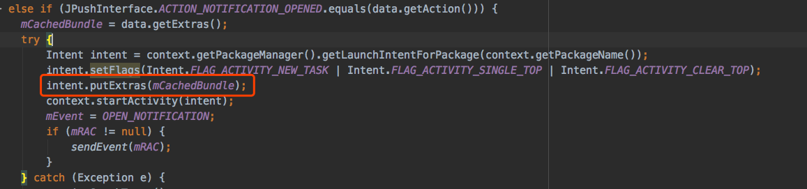

# jpush-react-native-helper
彻底解决android端, 点击通知栏不跳转至指定页面问题

**核心思路: 我翻看jpush-react-native源码时发现, 在用户点击通知栏消息的回调(见下图), 消息体bundle被放进了intent的extras中, 所以我认为在rn端首页, 可以通过桥接, 拿到当前activity的intent, 即可获取消息体bundle, 解析bundle, 就可以实现指定页面跳转了**



*note: 桥接仅针对android端, ios端不需要link原生代码*
## Installation(android)
- yarn add jpush-react-native-helper
- react-native link jpush-react-native-helper
- 打开android/app/src/main/java/你的包名/MainActivity.java, 添加如下代码

```
@Override
    public void onNewIntent(Intent intent) {
        super.onNewIntent(intent);
        //如果该方法已被重写, 那么添加 setIntent(intent); 这行就可以
        setIntent(intent);
    }
```

## Usage
在rn端页面栈的第一个页面, 通过getExtras方法获取消息体数据, 解析它, 即可知道该如何跳转

    setTimeout(() => {
            IntentUtil.getExtras()
                .then((data) => {
                    console.log(JSON.stringify(data));
                });
        }, 100);
注意由于android端的限制, getExtras方法需要延时调用, 不然在某些机型上, 得到的消息体会一直为空